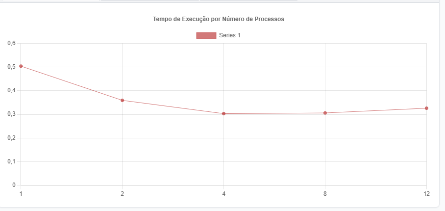
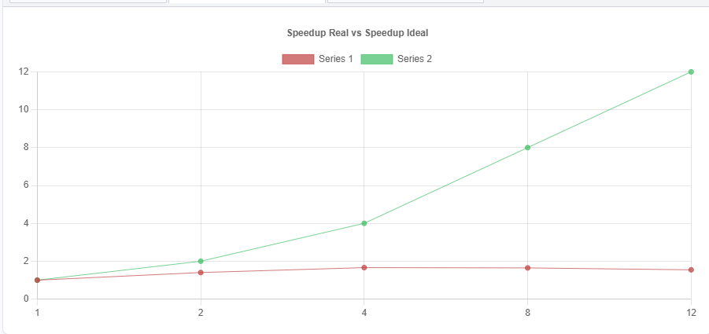
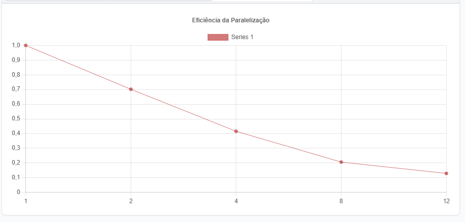

# Benchmark de Paralelismo com Multiprocessing em Python

**Disciplina:** Programação Concorrente e Distribuída  
**Aluno:** Lucas Vasconcelos Pessoa de Oliveira  
**Turma:** ADSN04  
**Professor:** Rafael  
**Data:** 18/03/2026  

---

## 1. Descrição do Problema

O programa foi feito pra somar uma lista de 10 milhões de números inteiros usando paralelismo, ou seja, dividindo o trabalho entre vários processos ao mesmo tempo pra ver se fica mais rápido.

A ideia é simples: a lista é dividida em partes iguais, cada processo soma a sua parte, e no final tudo é somado junto pra dar o resultado final.

| Pergunta | Resposta |
|----------|----------|
| Objetivo | Somar 10 milhões de números usando paralelismo e comparar os tempos |
| Volume de dados | 10.000.000 de números inteiros em um arquivo .txt |
| Algoritmo | Divisão da lista em partes + soma paralela com `multiprocessing.Pool.map()` |
| Complexidade | O(n/p) — quanto mais processos, menos trabalho por processo |

---

## 2. Ambiente Experimental

| Item | Descrição |
|------|-----------|
| Processador | Intel Core i5-12500 (12ª Geração) — 3.00 GHz |
| Número de núcleos | 6 núcleos físicos / 12 threads lógicas |
| Memória RAM | 16,0 GB |
| Sistema Operacional | Windows 11 |
| Linguagem utilizada | Python 3.x |
| Biblioteca de paralelização | `multiprocessing` (já vem com o Python) |
| Compilador / Versão | CPython — Python 3.x |

---

## 3. Metodologia de Testes

O tempo foi medido usando `time.perf_counter()`, que é bem preciso. Só foi contado o tempo do processamento em si, sem contar o tempo de leitura do arquivo.

Cada configuração foi rodada **3 vezes** e o tempo usado foi a **média** das 3 execuções, pra evitar que alguma variação aleatória do sistema distorcesse o resultado.

### Configurações testadas

- 1 processo
- 2 processos
- 4 processos
- 8 processos
- 12 processos

---

## 4. Resultados Experimentais

| Nº Processos | Tempo de Execução (s) |
|:------------:|:---------------------:|
| 1            | 0.5038                |
| 2            | 0.3591                |
| 4            | 0.3030                |
| 8            | 0.3059                |
| 12           | 0.3259                |

---

## 5. Cálculo de Speedup e Eficiência

O **speedup** mostra quantas vezes ficou mais rápido em relação ao tempo sem paralelismo:

```
Speedup(p) = T(1) / T(p)
```

A **eficiência** mostra se os processos estão sendo bem aproveitados (1,0 seria o ideal):

```
Eficiência(p) = Speedup(p) / p
```

---

## 6. Tabela de Resultados

| Processos | Tempo (s) | Speedup | Eficiência |
|:---------:|:---------:|:-------:|:----------:|
| 1         | 0.5038    | 1.00    | 1.00       |
| 2         | 0.3591    | 1.40    | 0.70       |
| 4         | 0.3030    | 1.66    | 0.42       |
| 8         | 0.3059    | 1.65    | 0.21       |
| 12        | 0.3259    | 1.55    | 0.13       |

> ✅ **Melhor resultado: 4 processos (0.3030s)**

---

## 7. Gráfico de Tempo de Execução



---

## 8. Gráfico de Speedup



---

## 9. Gráfico de Eficiência



---

## 10. Análise dos Resultados

O speedup ideal pra 4 processos seria 4,0x, mas o que conseguimos foi 1,66x. Isso acontece porque criar processos no Python tem um custo, e os dados precisam ser "empacotados" pra ser enviados entre os processos, o que consome tempo.

De 1 pra 2 processos o ganho foi bom (1,40x), de 2 pra 4 melhorou mais um pouco (1,66x), mas de 4 pra 8 quase não mudou nada, e com 12 processos ficou até mais lento do que com 4.

A eficiência caiu bastante conforme foram adicionados mais processos. Com 2 processos já caiu pra 0,70, e com 12 ficou em apenas 0,13 — ou seja, 87% do tempo estava sendo "desperdiçado" com overhead.

---

## 11. Conclusão

O paralelismo com `multiprocessing` funcionou e trouxe sim uma melhora em relação a rodar sem paralelismo. O melhor resultado foi com **4 processos**, que foi 1,66x mais rápido que sem paralelismo.

Mas o ganho foi bem menor do que o esperado na teoria. Isso acontece porque a operação de somar números é simples demais — o tempo que o Python gasta criando os processos e mandando os dados entre eles acaba sendo quase do mesmo tamanho que o próprio cálculo.

---

## Como executar

```bash
python benchmark_multiprocessing.py numero2.txt
```

Ou sem argumento (o programa vai pedir o caminho):

```bash
python benchmark_multiprocessing.py
```
